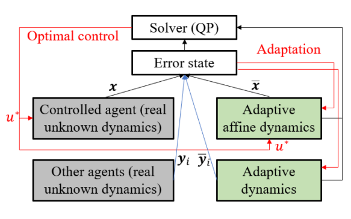

# Event-CBF
Safety-critical control for systems with unknown dynamics

 


There is one simple demo using event-triggered CBFs: Adaptive Cruise Control


If you find this helpful, please cite our work:
```
@article{xiao2022event,
title={Event-Triggered Control for Safety-Critical Systems With Unknown Dynamics},
author={Xiao, Wei and Belta, Calin and Cassandras, Christos G},
journal={IEEE Transactions on Automatic Control},
year={2023},
volume={68},
number={7},
pages={4143-4158},
publisher={IEEE}
}
```
```
 @inproceedings{xiao2021event,
title={Event-triggered safety-critical control for systems with unknown dynamics},
author={Xiao, Wei and Belta, Calin and Cassandras, Christos G},
booktitle={2021 60th IEEE Conference on Decision and Control (CDC)},
pages={540--545},
year={2021},
organization={IEEE}
}
```
